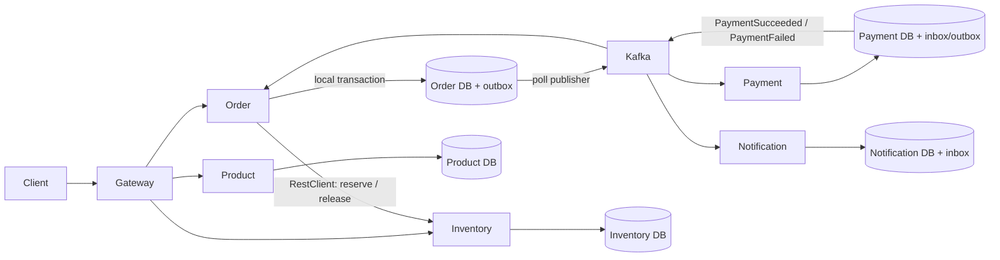

# Day 7 — Spring Boot microservices lab

A runnable e-commerce teaching system for the combined Day 7/8 microservices session. Six independently deployed applications show local transactions, synchronous HTTP, Kafka events, eventual consistency and compensation. The walkthrough follows the topic outline from the Microservices PPT conversation; the PPT file itself was not available for slide-by-slide verification.

## Requirements and versions

- Java **21**, Maven **3.9+** (the Docker build supplies both).
- Docker Desktop/Engine with Compose v2, running; allow roughly **8 GB RAM** and several GB disk for the whole stack.
- Internet access for Maven artifacts and container images on the first run.
- Python 3 only for the optional automated smoke script; curl or an IDE HTTP client for manual work.
- Spring Boot **3.5.16**, Spring Cloud **2025.0.3**, Resilience4j **2.3.0**, PostgreSQL **17.4**, Kafka **3.9.1** in KRaft mode. Versions are pinned for repeatability. Cloud 2025.0.x is the compatible train for Boot 3.5.x; later Cloud trains target Boot 4.

Compatibility sources: [Spring Cloud supported versions](https://github.com/spring-cloud/spring-cloud-release/wiki/Supported-Versions), [Boot 3.5 reference](https://docs.spring.io/spring-boot/3.5/reference/index.html), and Maven Central release metadata. See `VERIFICATION.md` for what was actually run.

## Architecture and ownership



| Module | HTTP port | Database host port | Responsibility |
|---|---:|---:|---|
| api-gateway | 8080 | — | Routing, correlation header |
| product-service | 8081 | 5433 | Product CRUD and pricing catalogue |
| inventory-service | 8082 | 5434 | Atomic stock reservation/release |
| order-service | 8083 | 5435 | Durable order state machine, Saga and outbox |
| payment-service | 8084 | 5436 | Deterministic payment simulator and result events |
| notification-service | 8085 | 5437 | Durable notification records; no real email/SMS |

Each business service has its own PostgreSQL instance, credentials and migrations. There are no cross-database joins or foreign keys. `common` contains the teaching event contract and infrastructure, not shared business tables. In larger systems publish versioned contracts separately to avoid coupling all deployments. Product creation intentionally does not create stock; use the seeded product for the Saga. Adding a catalogue-to-inventory provisioning event is an extension exercise.

## Quick start: everything in Docker

Run commands from `examples/day7` in the full training repository (or the root of a standalone copy):

```bash
cp .env.example .env
docker compose --profile apps up --build -d
docker compose --profile apps ps
docker compose logs -f order-service payment-service notification-service
```

The first image build downloads dependencies. Database and Kafka health checks gate business-service startup; the gateway can start earlier, so temporary 502 responses during startup are expected. Wait for the application health endpoints before running requests:

```bash
curl -f http://localhost:8083/actuator/health/readiness
python3 scripts/smoke.py
```

A successful smoke run prints `PASS` and consumes two units of the seed stock. Use fresh order keys on subsequent manual runs. All published ports bind only to loopback.

```bash
docker compose --profile apps down       # preserve data
# Deliberate reset for a new class: destroys this lab's persisted data.
docker compose --profile apps down -v
```

## Run applications from your IDE

```bash
docker compose up -d                    # infrastructure only; apps are profile-gated
mvn clean verify
```

Then run each module's `training.<service>.Application` main class (gateway package is `training.gateway`). Defaults connect to the host ports above. Alternatively, after packaging, run the six jars in separate terminals:

```bash
java -jar product-service/target/product-service-1.0.0.jar
java -jar inventory-service/target/inventory-service-1.0.0.jar
java -jar order-service/target/order-service-1.0.0.jar
java -jar payment-service/target/payment-service-1.0.0.jar
java -jar notification-service/target/notification-service-1.0.0.jar
java -jar api-gateway/target/api-gateway-1.0.0.jar
```

Compose reads `.env`; local Java processes do not. If you change the database password, export `DB_PASSWORD` in the IDE environment too. `DB_URL`, `DB_USER`, `DB_PASSWORD`, `KAFKA_BOOTSTRAP_SERVERS`, `INVENTORY_URL` and `PORT` override defaults. Gateway destinations use `PRODUCT_URL`, `INVENTORY_URL`, `ORDER_URL`, `PAYMENT_URL`, `NOTIFICATION_URL`.

## First requests (also importable into Postman)

The seed product has 100 units initially. `Idempotency-Key` must be a UUID and becomes the order ID. Reuse the same key and identical body to retry; a changed body returns 409.

```bash
curl http://localhost:8080/products
curl http://localhost:8080/inventory/11111111-1111-1111-1111-111111111111
curl -i -X POST http://localhost:8080/orders \
  -H 'Content-Type: application/json' \
  -H 'Idempotency-Key: 22222222-2222-2222-2222-222222222222' \
  -H 'X-Correlation-ID: classroom-success' \
  -d '{"productId":"11111111-1111-1111-1111-111111111111","quantity":2,"failPayment":false}'
curl http://localhost:8080/orders/22222222-2222-2222-2222-222222222222
```

Creation returns **202 Accepted**, because payment has not completed. Poll until `CONFIRMED`. Repeat using key `33333333-3333-3333-3333-333333333333` and `failPayment:true`; the final status is `CANCELLED`, with stock restored. `requests.http` includes CRUD, stock, standalone reserve/release, payment, notification and probe requests. Do not manually release reservations belonging to active Sagas; those endpoints model trusted internal APIs.

## The Saga, explained

1. Order creation commits a `PENDING` row before any remote call. This is the durable work record.
2. A scheduled worker locks pending rows with `FOR UPDATE SKIP LOCKED` and calls inventory synchronously. Inventory serializes operations by order ID and uses a conditional stock decrement, so concurrent orders cannot oversell.
3. A reservation result is stable. Repeating the same order/product/quantity returns the stored decision. Stock rejection changes the order to `REJECTED` and produces `OrderRejected`; payment never starts.
4. Reservation success writes `AWAITING_PAYMENT` plus `OrderCreated` to the local outbox in one database transaction.
5. The outbox publisher waits for Kafka's ACK, then marks the row published. A crash between those steps republishes the same event ID. This is **at-least-once**, not exactly-once delivery.
6. Payment consumes `OrderCreated`. Its inbox insert, simulated payment record and result outbox write commit together. A duplicate event produces no second payment. A unique order ID also guards semantically repeated creation events with different event IDs.
7. `PaymentSucceeded` moves the order to `CONFIRMED`. `PaymentFailed` moves it to `COMPENSATING`. The durable worker retries inventory release until it succeeds, then commits `CANCELLED` and `OrderCancelled` together.
8. Notification has its own consumer group. It sees `OrderCreated` and terminal order events, inserting durable notification records with both event-ID and order/type deduplication.

This is a **hybrid Saga**: payment results use event choreography; order owns a small durable coordinator for inventory reservation and compensation. It is not pure choreography, a distributed transaction, or automatic rollback across databases. Compensation is a new business transaction. Inventory reservation calls that time out remain pending and are retried using the same identity; treating an uncertain timeout as rejection could leak reserved stock.

A single teaching topic has three partitions, keyed by order ID. Each service's distinct consumer group receives the events; replicas within a group share partitions. Retention bounds replay history. Business writes and inbox inserts use local Spring transactions, and Kafka commits the record offset after listener success. Poison messages are retried indefinitely here so failures remain visible; production needs an explicit retry/DLT policy, alerts, replay tools and retention/pruning for inbox/outbox rows.

## Resilience and failure experiments

Inventory calls use a 1-second connect timeout, 2-second transport read timeout, plus a Resilience4j **TimeLimiter** of 2.5 seconds backed by a bounded four-thread executor. A transport timeout bounds physical I/O; a TimeLimiter bounds caller waiting and cannot guarantee remote cancellation. Retry allows three attempts with a 200 ms delay; the circuit opens after at least five calls and a 50% failure rate, then tries recovery after ten seconds. The fallback throws an explicit `InventoryUnavailable` outcome: it never pretends a reservation succeeded. Order remains `PENDING` and the worker tries later. These settings are deliberately short for class, not production tuning.

```bash
docker compose stop inventory-service
# Submit a new order: it stays PENDING; inspect order-service logs and metrics.
docker compose start inventory-service
# The same order eventually progresses without a second client submission.
docker compose stop payment-service
# Submit an order: it waits at AWAITING_PAYMENT.
docker compose start payment-service
# Kafka replays its unprocessed records.
```

Stop inventory after a payment-failure event to observe `COMPENSATING`, then restore it to observe `CANCELLED`. To study duplicate delivery, reset an outbox row to `published=false` in its owning database; observe that consumers retain a single business result. Reset only in this disposable lab. Scheduled workers hold local row locks during bounded network calls for readability; production workers generally use leases and separate claim/execute/finalize transactions for throughput.

## Observability and probes

`X-Correlation-ID` is validated/generated at the gateway, propagated on REST calls, persisted with the order and copied to events. Servlet logs and notification logs include it in MDC. Boot emits structured JSON logs. Micrometer tracing with the OpenTelemetry bridge supplies trace/span IDs; auto-configured RestClient builders and Kafka observations propagate tracing context. A scheduled Saga step/outbox dispatch is a new asynchronous execution, so the persisted correlation ID is the reliable identifier spanning the whole business workflow. Trace export/collector is an extension, not bundled here.

Every app exposes `/actuator/health`, `/actuator/health/liveness`, `/actuator/health/readiness` and `/actuator/prometheus`. Business readiness includes its database; liveness does not depend on external systems. Kafka unavailability appears as publishing failures/backlog and is not part of the default readiness group. Kafka metrics, HTTP timers and circuit-breaker metrics are available through Actuator. For example:

```bash
curl http://localhost:8083/actuator/prometheus
curl http://localhost:8083/actuator/metrics
```

## Test strategy

`mvn test` runs unit tests and PostgreSQL Testcontainers examples. When Docker is absent, container tests are explicitly skipped; read the test summary rather than assuming database coverage passed. `mvn clean verify` also packages the discovery server. `python3 scripts/smoke.py` is an independent full-stack test covering CRUD, successful payment, compensation, repeated order creation, conflicting keys, insufficient stock and notifications. CI runs the database tests with Docker available and then runs the full Compose smoke test.

Unit tests cover Saga branches, failure propagation, payment event selection and event metadata. PostgreSQL tests exercise Flyway migrations, reservation replay, release replay and competing reservations. JDBC is chosen to expose SQL locking and transactions directly, building on the earlier JPA day without hiding the concurrency rules. No H2 substitution is used for PostgreSQL-specific locking.

## Eureka demonstration

```bash
docker compose -f docker-compose.yml -f docker-compose.discovery.yml --profile apps --profile discovery up --build -d
# Open http://localhost:8761
```

The normal lab uses Docker Compose DNS, so Eureka is disabled by default. The discovery override starts the Eureka server and sets `EUREKA_CLIENT_ENABLED=true` for the gateway and business services. Within about 30 seconds, the Eureka dashboard should show:

- `API-GATEWAY`
- `PRODUCT-SERVICE`
- `INVENTORY-SERVICE`
- `ORDER-SERVICE`
- `PAYMENT-SERVICE`
- `NOTIFICATION-SERVICE`

The gateway and `order-service` still use explicit URLs for the main request flow. That keeps the code easier to teach while still showing service registration clearly. After the dashboard demo, compare this with Docker Compose service names such as `http://inventory-service:8082`. Kubernetes Service/DNS commonly provides the same kind of discovery and load balancing in production, which is why Eureka is often unnecessary in newer deployments.

Run the same smoke test while Eureka is enabled:

```bash
python3 scripts/smoke.py
docker compose -f docker-compose.yml -f docker-compose.discovery.yml --profile apps --profile discovery down -v
```

## Teaching flow (about 150 minutes)

| Time | PPT concept | Code / exercise |
|---|---|---|
| 0–15 min | Monolith, boundaries, cohesion, database ownership | Architecture; explain why there are five databases and no shared entities |
| 15–30 min | Contracts, gateway, external configuration | Start stack, Product CRUD, environment URLs, request validation |
| 30–50 min | Synchronous REST, discovery, load balancing | Inspect InventoryClient, reservations, compare DNS and optional Eureka |
| 50–70 min | Timeout, retry, circuit breaker, fallback | Stop inventory; observe PENDING and recovery; discuss retry amplification |
| 70–95 min | Kafka, partitions, consumer groups, delivery | OrderCreated, separate Payment/Notification groups, stop/restart consumer |
| 95–120 min | Eventual consistency, Saga, outbox, idempotency | Payment failure and compensation; replay outbox; identify crash windows |
| 120–135 min | Observability, probes, operations | JSON logs, correlation IDs, metrics, database readiness |
| 135–150 min | Tests, deployment, production trade-offs | Concurrency test, full smoke; discuss Kubernetes and security |

## Deliberate production boundaries and follow-up exercises

This repository is an unauthenticated local training lab with simulated payments/notifications. The gateway routes but does not implement JWT, CORS policy, rate limiting or authorization; reuse Day 6's resource-server lesson to secure both the gateway and each service. A gateway alone is not a service security boundary. There is no real payment provider, email sender, pricing snapshot/charge amount, Kubernetes manifest, Config Server or tracing collector. Those PPT topics are discussion/extensions rather than falsely labelled completed integrations.

For production: remove public reservation controls, authenticate service calls, use TLS and managed secrets, pin scanned images by digest, implement notification delivery outbox/provider idempotency, add payment timeout reconciliation, price snapshots, stock provisioning and cancellation rules, bound retries with operational recovery, prune event tables, tune worker concurrency and add contract tests. A failed external charge must be reconciled with the provider before retrying; our deterministic simulator avoids that uncertainty. Avoid a shared database or blindly retrying non-idempotent remote operations.
